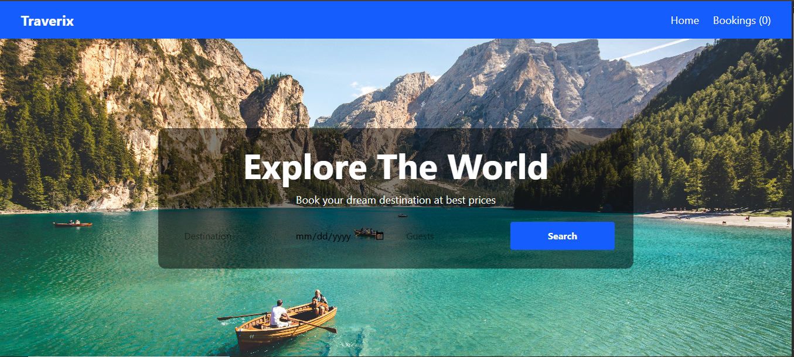

# 🌍 Traverix — The Tour & Travels




<div align="center">

[](https://traverix.netlify.app/)
[](https://traverix-the-tour-travels.onrender.com)
[](https://www.mongodb.com/)
[](https://react.dev/)

**A modern full-stack tour & travel booking web application built with React, Node.js, Express, and MongoDB.**

[🌐 Live Demo](https://traverix.netlify.app/) · [🔌 API](https://traverix-the-tour-travels.onrender.com) · [🐛 Report Bug](https://github.com/YoteshMishra/traverix---The-Tour-Travels/issues) · [✨ Request Feature](https://github.com/YoteshMishra/traverix---The-Tour-Travels/issues)

</div>

---

## 📋 Table of Contents

- [About The Project](#-about-the-project)
- [Live Links](#-live-links)
- [Tech Stack](#-tech-stack)
- [Features](#-features)
- [Project Structure](#-project-structure)
- [Getting Started](#-getting-started)
- [Environment Variables](#-environment-variables)
- [API Endpoints](#-api-endpoints)
- [Deployment](#-deployment)
- [Author](#-author)

---

## 🎯 About The Project

**Traverix** is a full-stack tour and travel booking platform that allows users to explore travel packages, view detailed itineraries, and make bookings — all in one place. Built with a modern tech stack and deployed on cloud platforms for production use.

---

## 🔗 Live Links

| Service | URL |
|---|---|
| 🌐 Frontend (Netlify) | [https://traverix.netlify.app](https://traverix.netlify.app/) |
| 🔌 Backend API (Render) | [https://traverix-the-tour-travels.onrender.com](https://traverix-the-tour-travels.onrender.com) |
| 📦 Packages API | [/api/packages](https://traverix-the-tour-travels.onrender.com/api/packages) |
| 📋 Bookings API | [/api/bookings](https://traverix-the-tour-travels.onrender.com/api/bookings) |

---

## 🛠 Tech Stack

### Frontend
| Technology | Purpose |
|---|---|
| ⚛️ React + Vite | UI framework & build tool |
| 🎨 Tailwind CSS | Styling & responsive design |
| 🔀 React Router DOM | Client-side routing |
| 🌐 Netlify | Frontend deployment |

### Backend
| Technology | Purpose |
|---|---|
| 🟢 Node.js | Runtime environment |
| ⚡ Express.js | Web framework |
| 🍃 Mongoose | MongoDB ODM |
| 🔒 dotenv | Environment variables |
| 🌍 CORS | Cross-origin resource sharing |
| ☁️ Render | Backend deployment |

### Database
| Technology | Purpose |
|---|---|
| 🍃 MongoDB Atlas | Cloud database |

---

## ✨ Features

- 🏖️ **Browse Tour Packages** — Explore a wide range of tour packages with details
- 📋 **Package Details** — View full itinerary, inclusions, and pricing
- 📝 **Booking System** — Book tours with a seamless booking form
- 📊 **My Bookings** — Track all your bookings in one place
- 📱 **Responsive Design** — Works perfectly on mobile, tablet, and desktop
- ⚡ **Fast Performance** — Built with Vite for lightning-fast load times

---

## 📁 Project Structure

```
traverix/
├── client/                  # React frontend
│   ├── public/
│   │   └── _redirects       # Netlify routing fix
│   ├── src/
│   │   ├── app/
│   │   ├── assets/
│   │   ├── components/      # Reusable components
│   │   ├── config/          # API config
│   │   ├── data/
│   │   ├── features/
│   │   └── pages/           # Page components
│   │       ├── Home.jsx
│   │       ├── Bookings.jsx
│   │       └── PackageDetails.jsx
│   ├── .env                 # Frontend env variables
│   ├── index.html
│   ├── package.json
│   └── vite.config.js
│
├── server/                  # Express backend
│   ├── config/
│   │   └── db.js            # MongoDB connection
│   ├── data/
│   │   └── packages.js      # Seed data
│   ├── models/
│   │   └── Booking.js       # Booking schema
│   ├── routes/
│   │   ├── bookingRoutes.js
│   │   └── packageRoutes.js
│   ├── .env                 # Backend env variables
│   ├── package.json
│   └── server.js            # Entry point
│
├── .gitignore
└── README.md
```

---

## 🚀 Getting Started

### Prerequisites

Make sure you have the following installed:
- [Node.js](https://nodejs.org/) (v18 or higher)
- [Git](https://git-scm.com/)
- [MongoDB Atlas](https://www.mongodb.com/) account

### Installation

1. **Clone the repository**
```bash
git clone https://github.com/YoteshMishra/traverix---The-Tour-Travels.git
cd traverix---The-Tour-Travels
```

2. **Setup Backend**
```bash
cd server
npm install
```

3. **Setup Frontend**
```bash
cd ../client
npm install
```

4. **Add environment variables** (see below)

5. **Run the backend**
```bash
cd server
node server.js
```

6. **Run the frontend**
```bash
cd client
npm run dev
```

7. Open [http://localhost:5173](http://localhost:5173) in your browser ✅

---

## 🔐 Environment Variables

### Backend (`server/.env`)
```env
MONGO_URI=your_mongodb_atlas_connection_string
PORT=5000
NODE_ENV=development
```

### Frontend (`client/.env`)
```env
VITE_API_URL=http://localhost:5000
```

> ⚠️ Never commit `.env` files to GitHub. They are already in `.gitignore`.

---

## 📡 API Endpoints

### Packages
| Method | Endpoint | Description |
|---|---|---|
| GET | `/api/packages` | Get all tour packages |
| GET | `/api/packages/:id` | Get single package |

### Bookings
| Method | Endpoint | Description |
|---|---|---|
| GET | `/api/bookings` | Get all bookings |
| POST | `/api/bookings` | Create new booking |
| DELETE | `/api/bookings/:id` | Delete a booking |

---

## ☁️ Deployment

### Frontend — Netlify
| Setting | Value |
|---|---|
| Base directory | `client` |
| Build command | `npm run build` |
| Publish directory | `dist` |
| Environment variable | `VITE_API_URL` = backend URL |

### Backend — Render
| Setting | Value |
|---|---|
| Root directory | `server` |
| Build command | `npm install` |
| Start command | `node server.js` |
| Environment variable | `MONGO_URI`, `PORT`, `NODE_ENV` |

### Database — MongoDB Atlas
- Created cluster on [MongoDB Atlas](https://cloud.mongodb.com)
- Added `0.0.0.0/0` to IP Access List for Render access

---

## 👨‍💻 Author

**Yotesh Mishra**

[](https://github.com/YoteshMishra)

---

## 📄 License

This project is open source and available under the [MIT License](LICENSE).

---

<div align="center">
  Made with ❤️ by Yotesh Mishra
</div>
